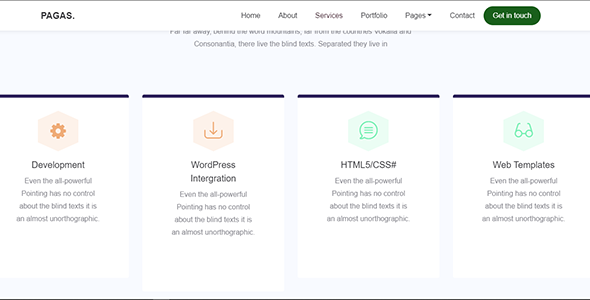

# Expertly
This Template corvers beautiful site that you need for webiste, this template written in clean HTML         and CSS 

    
<strong>Overview</strong> 

    

    

        This Template corvers beautiful site that you need for webiste, this template written in clean HTML
        and CSS , Javascript, JQuery, Boostrap etc. This is clean code and easy to understand,
        CSS and Boostrap with the power of each component has dedicated file for styling make it very beautiful looking
        UI. JQuery handle the DOM manipulation, javascript control the page , also handle the animation for
        the page
    

    

        
    

    

        
    

    

        
    

    

        
    

    

        
    

    

        
    

    

        
    

    

        
    

    

        
    

    

        
    

    

        
    

    

        
    

    

        
    

    

        
    

